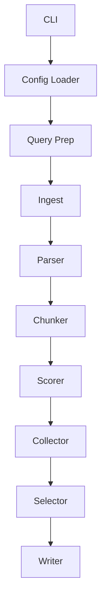
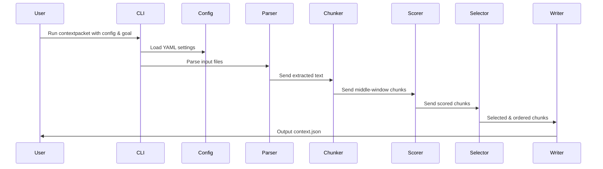

# Development Plan – ContextPacket (Cross-Encoder MVP)

_Last updated: 2025-08-10_

---

## Phase 0 – Project Setup
1. **Repo init & tooling**
   - Create Git repo, set up `uv` or `poetry` for dependency management.
   - Configure `ruff` + `mypy --strict` + `pytest`.
   - Pre-commit hooks for lint, type check, and tests.
2. **Directory structure**
   ```
   contextpacket/
       __init__.py
       config.py
       ingest.py
       parser.py
       chunker.py
       scorer.py
       selector.py
       writer.py
       cli.py
   tests/
       ...
   ```
3. **Fixtures**
   - Add demo corpus (`tests/corpus_demo`) with small HTML, PDF, plaintext docs.

---

## Phase 1 – Config & CLI
1. **Config loader**
   - YAML → pydantic dataclass.
   - Defaults: chunk size 512, overlap = chunk_size / 2 (256 window middle = 128 before + 256 middle + 128 after), budgets, score threshold null.
2. **CLI entrypoint**
   - `contextpacket --config cfg.yml --goal "..."`.
   - Hooks to pipeline stages.
   - Optional `--dry-run` to stop after query prep.

---

## Phase 2 – Query Prep
1. **LLM query-expander (optional)**
   - Prompt template: "Refine and expand user query".
   - Configurable LLM provider; skip if disabled.
2. **Unit tests**
   - Mock LLM call, ensure expansion and confirm step works.

---

## Phase 3 – Ingest & Parse
1. **Ingest**
   - Walk directory, filter by allowed extensions.
   - Hash files (SHA-256).
2. **Parsers**
   - HTML: BeautifulSoup → text with heading markers.
   - PDF: PyMuPDF, OCR fallback (pytesseract).
   - Plaintext: direct read.
3. **Unit tests**
   - Parse known fixture files, compare output to expected text.

---

## Phase 4 – Chunker
1. **Sliding window splitter**
   - Configurable `chunk_size` and fixed overlap = chunk_size / 2.
   - Extract **middle 256 tokens** of a 512-token window for scoring.
   - Track chunk’s `(doc_id, page/line offsets, order)`.
2. **Tests**
   - Verify overlap and middle extraction logic.

---

## Phase 5 – Scorer
1. **Cross-encoder wrapper**
   - Load model from `model_path` or HF hub.
   - Batch score `(query, chunk_text)` pairs.
   - Return score floats (0–1).
   - Use mxbai v2 (see the doc mxbai.md)
2. **Tests**
   - Mock model → fixed scores.
   - Ensure batch order preserved.

---

## Phase 6 – Collector & Selector
1. **Collector**
   - Store `(chunk_id, order, tokens, score, citation)` in list or JSONL.
2. **Selector**
   - Sort by score (desc).
   - Take top chunks until token budget hit.
   - Resort by `order` for final output.
3. **Tests**
   - Simulate scores and ensure correct ordering.

---

## Phase 7 – Writer
1. **JSON output**
   - Write `context.json` with query, chunks, budgets.
   - Include citation format `§hash:media:start:end`.
2. **Tests**
   - Validate JSON schema and token counts.

---

## Phase 8 – Integration & E2E
1. **End-to-end run**
   - Parse demo corpus → chunk → score → select → write JSON.
   - Verify token budgets.
2. **Manual spot-check**
   - Confirm F1 ≥ 0.85 on demo corpus.

---

## Phase 9 – Polish
1. **Docs**
   - README: install, run, config reference.
2. **Benchmarks**
   - Measure total runtime on demo corpus.

---

## Deliverables
- `contextpacket` CLI tool.
- `context.json` output matching PRD format.
- ≥ 90% pytest coverage on all non-LLM logic.
- Type-clean (`mypy --strict`) and lint-clean (`ruff`).

---

## Dependency Diagram



---

## Control Flow Diagram


